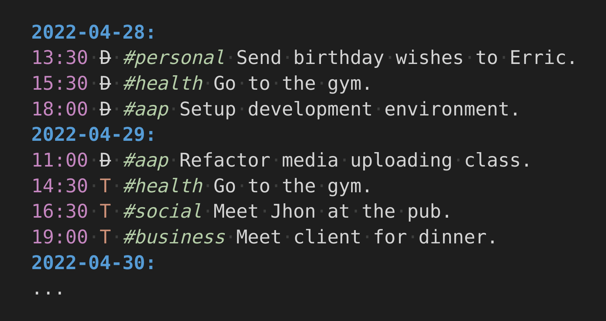

# Life Log

My personal agenda and task management method. I keep a single text file ending 
with the extension of `.life`. Inside this file I list everything I have done 
and still need to do. 

#### All there is to know:

- Date: `0000-00-00`
- Time: `00:00am`
- Todo: `T`
- Done: `D`
- Tags: `#tag`